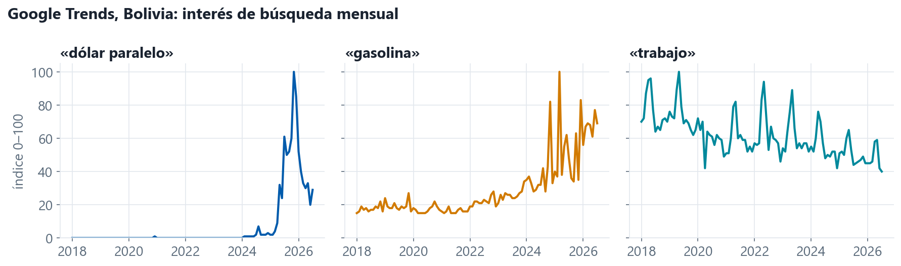
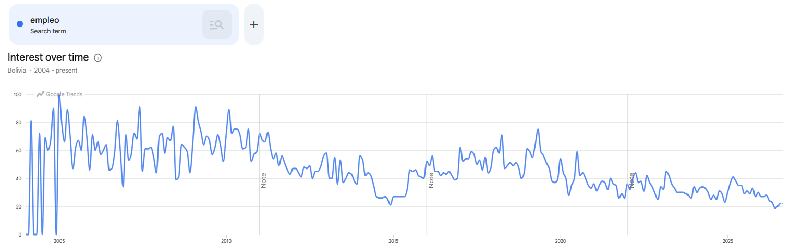
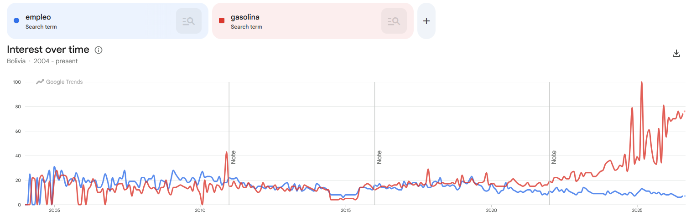

## Índice de intensidad de búsquedas

Google Trends mide el **interés relativo** en un término de búsqueda, por país y por mes.

- **Consumo:** «supermercado», «electrodomésticos», «autos usados»
- **Empleo:** «trabajo», «convocatoria», «computrabajo»
- **Precios y dólar:** «dólar paralelo», «inflación», «gasolina»
- **Crédito:** «préstamo», «tarjeta de crédito»

::: notes
~1 min. Choi y Varian (2012) popularizaron la idea: las búsquedas "predicen el presente".
:::

## Google Trends, Bolivia: interés de búsqueda mensual

{fig-align="center" width="100%"}

La escasez de dólares y de combustible se ve en las búsquedas **en el mes en que ocurre**; la estadística oficial llega después.

::: notes
~1 min. «dólar paralelo» es prácticamente cero hasta 2024: el término casi no se buscaba. Pregunta al grupo: ¿qué otros términos habrían anticipado 2024–25?
:::

# Descarga de datos {.divisor background-color="#003D73"}

## Lección 1. Un término por consulta

El índice es **relativo a los parámetros** de la búsqueda: Google escala cada consulta de 0 a 100 respecto a su término más buscado. **Buscar términos en lote puede cambiar la serie.**

:::: {.columns}
::: {.column width="50%"}
**«empleo» solo:** rango 0–100

{width="100%"}
:::
::: {.column width="50%"}
**«empleo» + «gasolina»:** bajo 30

{width="100%"}
:::
::::

::: notes
Misma búsqueda, mismo país, mismo periodo. Lo único que cambia es el segundo término: como «gasolina» se dispara en 2023–25, pasa a ser el 100 y «empleo» queda reescalado hacia abajo. Por eso el cuaderno consulta un término a la vez.
:::

## Lección 2. La librería

:::: {.columns}
::: {.column width="50%"}
### ✗ `pytrends`
Archivada en abril de 2025. Devuelve `429 Too Many Requests` **en la primera llamada**. No es un bloqueo: la librería está rota.
:::
::: {.column width="50%"}
### ✓ `trendspy`
Sucesora mantenida. Sin clave, sin cuenta.

```{.python}
from trendspy import Trends
tr = Trends(request_delay=2.0)
d = tr.interest_over_time(
    ["dolar paralelo"], geo="BO",
    timeframe="2004-01-01 2026-09-27")
```
:::
::::

## Lección 3. La página tiene límites

- Con 1 segundo entre consultas, la **42.ª** falla; con 2 segundos pasan las 67
- Después de una corrida completa, Google **bloquea por decenas de minutos**
- El cuaderno **guarda tras cada término** y retoma donde quedó

::: {.alerta}
**Puede ser más seguro hacer las búsquedas desde la página web** (trends.google.com) y descargar el CSV a mano.
:::

## El cuaderno `act3_gtrends.ipynb`

:::: {.columns}
::: {.column width="50%"}
### Parte A · `trendspy`
- Lee los términos de `BOL_GTrends_Keywords_*.xlsx`
- Consulta **un término a la vez**, con 2 s de pausa
- **Guarda tras cada término** y salta los que ya tiene: si se corta, se vuelve a correr y sigue
- Descarta términos con muy pocos meses distintos de cero
- Escribe `raw/gtrends.csv` y grafica
:::
::: {.column width="50%"}
### Parte B · descarga manual
- Si Google bloquea, lista los **términos que faltan**
- Imprime el **enlace exacto** de cada uno, con el mismo país y periodo
- Se descarga el CSV desde la página y se deja en `raw/` **sin renombrarlo**
- La última celda lee esos archivos y arma el **mismo** `raw/gtrends.csv`
:::
::::

::: notes
Las dos partes terminan en el mismo archivo, así que el resto del flujo (2_data_build) no distingue de dónde vino cada serie. En el taller se puede empezar directamente por la parte B si la red ya está bloqueada.
:::
