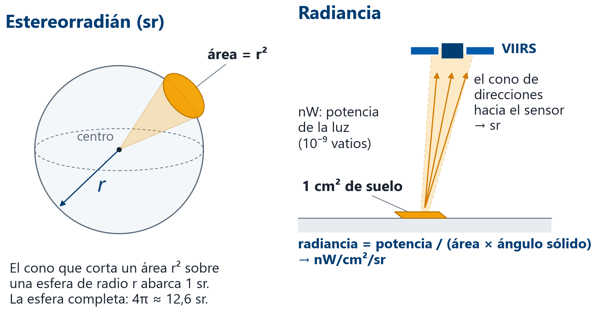
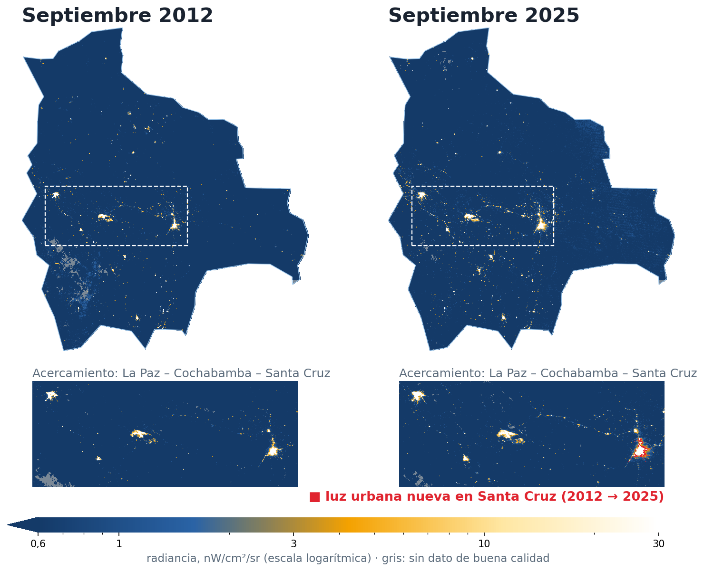
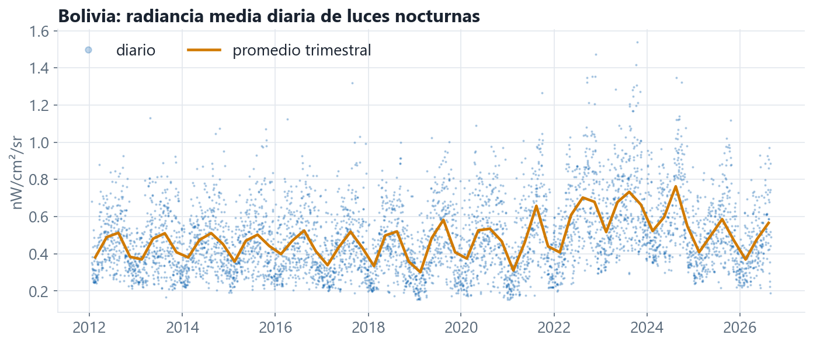
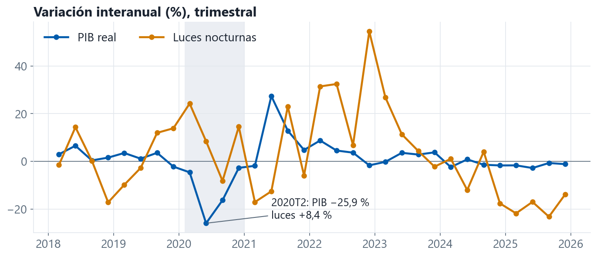
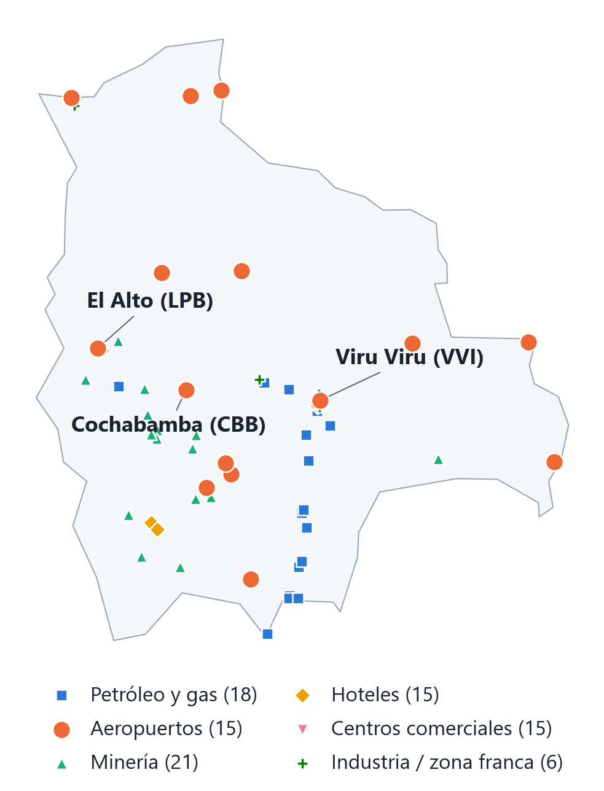
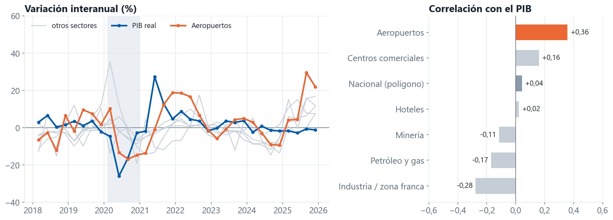

## La Tierra de Noche

:::: {.columns}
::: {.column width="55%"}
La luz artificial nocturna es un **indicador indirecto de actividad**:

- consumo de energía, comercio y transporte
- actividad **informal**, que las encuestas captan mal
- crecimiento urbano y electrificación
- interrupciones: apagones, conflictos, desastres

Y llega **casi en tiempo real**.
:::
::: {.column width="45%"}
::: {.cifra .grande}
[~7 días]{.valor}

[de rezago, frente a ~3 meses del PIB trimestral]{.leyenda}
:::
:::
::::

::: notes
~1 min. La idea: el PIB llega tarde; la luz llega en una semana. Pregunta al grupo: ¿qué actividad boliviana creen que se ve desde el espacio y cuál no?
:::

# El dato {.divisor background-color="#003D73"}

[Parte 1]{.etiqueta}

Qué mide el satélite y cómo se descarga

## El producto: NASA Black Marble

| | |
|---|---|
| **Producto** | VNP46A2: radiancia **diaria**, corregida por luna y atmósfera |
| **Resolución** | píxeles de ~500 m, cobertura global |
| **Unidad** | nW/cm²/sr |
| **Desde** | enero de **2012** |
| **Acceso** | NASA LAADS: cuenta gratuita + *token* (vence a los 60 días) |

::: {.nota}
Hay también un compuesto **mensual** (VNP46A3), más limpio pero con más rezago. En el taller usamos el diario y lo agregamos nosotros.
:::

::: notes
~1 min. Subrayar: el token vence. Es la causa número uno de "no descarga nada".
:::

## ¿Qué es un nW/cm²/sr?

:::: {.columns}
::: {.column width="64%"}
{width="100%"}
:::
::: {.column width="36%"}
| en Bolivia | nW/cm²/sr |
|---|---:|
| **mínimo** | **0** |
| fondo oscuro | ~0,2 |
| minas | ~3 |
| aeropuertos | ~13 |
| centros urbanos | 60–110 |
| refinería | ~150 |
| **máximo** | **sin tope** |

[El producto no tiene techo: en Bolivia se ven píxeles de hasta ~40.000 (antorchas de gas, incendios).]{.fuente}
:::
::::

::: {.nota}
**¿Cuánto mide un píxel?** En Bolivia, unos **460 m × 440 m ≈ 0,2 km²** (≈ 28 canchas de fútbol).
:::

::: notes
~1,5 min. Píxel: la grilla es de 15″ × 15″ de arco (1/240°), ~463 m N-S y ~443 m E-O a 17–18° S; todo lo que ocurre en ese cuadrado se promedia en un valor. Radiancia = cuánta potencia de luz (nanovatios) sale de cada cm² de suelo hacia cada estereorradián de direcciones. El estereorradián es la versión 3D del radián: el cono que, sobre una esfera de radio r, recorta un área r². Dividir por sr hace que la medida no dependa de la distancia al satélite. Valores: medianas de 2025 en nuestros sitios (minería 3,2; aeropuertos 13,3, Cochabamba 44; centros comerciales 77; hoteles 84; refinería Gualberto Villarroel 150). El producto VNP46A2 v002 es float32 con rango válido ≥ 0 y sin máximo: la pieza h11v10 llega a 42.359 el 1-sep-2026; el punto más brillante de septiembre 2025 (21.786) está en el Chaco, −20,2° / −62,3°, probablemente una antorcha de gas o un incendio.
:::

## Bolivia en piezas

:::: {.columns}
::: {.column width="50%"}
La NASA reparte el planeta en **piezas** de 10° × 10°. Bolivia toca cinco; descargamos cuatro:

| pieza | % del territorio |
|---|---:|
| h11v10 | 77,8 % |
| h11v11 | 14,8 % |
| h12v10 | 7,1 % |
| h11v09 | 0,3 % |
| ~~h12v11~~ | 0,02 % |
:::
::: {.column width="50%"}
::: {.alerta}
**Presupuesto de disco.** Un archivo diario pesa ~25 MB → 4 piezas ≈ **100 MB por día**.

- un año ≈ 36 GB
- todo el archivo desde 2012 ≈ **500 GB**
:::
:::
::::

::: notes
~1 min. Anécdota real del proyecto: dejar la ventana vacía descargó 490 GB y llenó el disco. Por eso el valor por defecto ahora es de dos semanas.
:::

## Septiembre contra septiembre

:::: {.columns}
::: {.column width="64%"}
{height="580"}
:::
::: {.column width="36%"}
En 13 años:

- la superficie con **luz urbana** crece de unos **2.000 a 3.400 km²** (+69 %)
- se enciende la **ruta Cochabamba – Santa Cruz**
- **Santa Cruz** casi duplica su área iluminada: de **470 a 890 km²** (en rojo)
:::
::::

::: notes
~1,5 min. Por qué no una sola noche: un mapa de un día mezcla nubes (la capa gap-filled rellena lo nublado con valores viejos), luna y resplandor del cielo (airglow). Medido en la pieza h11v10: el 19-ene-2012 tenía 83 % de nubes y sin luna, fondo en 0,2–0,3 nW; el 1-sep-2026, cielo despejado y con luna, fondo en ~0. Por eso: misma estación (septiembre), las 5 noches más despejadas, sólo píxeles de buena calidad, mediana por píxel; escala logarítmica con piso en 0,6 nW para que el brillo del cielo no se vea. "Luz urbana" = más de 5 nW. Cochabamba crece ×1,5 y La Paz–El Alto ×1,4; Santa Cruz ×1,9. Gris: el salar de Uyuni y otros píxeles sin ninguna noche de buena calidad.
:::

# La señal {.divisor background-color="#003D73"}

[Parte 2]{.etiqueta}

De una imagen a una serie de tiempo, y qué dice del PIB

## De píxeles a una serie

:::: {.columns}
::: {.column width="50%"}
### Por área
Promedio de todos los píxeles dentro del polígono de Bolivia (GADM).
:::
::: {.column width="50%"}
### Por coordenadas
Radiancia en **90 lugares** con coordenadas: aeropuertos, hoteles, zonas industriales, minería, petróleo y gas, centros comerciales.
:::
::::

## El ruido diario y la señal trimestral

{fig-align="center" width="100%"}

Picos a mitad de año, todos los años: estación seca (menos nubes) y temporada de quemas. **Estacionalidad que hay que quitar antes de modelar.**

::: notes
~1 min. Los incendios también emiten luz: VIIRS no distingue una ciudad de un chaqueo. Pregunta: ¿cómo lo separarían? (máscaras, sitios fijos, mediana).
:::

## Comovimiento NTL-PIB

{fig-align="center" width="100%"}

Correlación interanual: 0,04 (0,34 sin 2020–21)

::: notes
~1,5 min. Mensaje honesto: la luz agregada del país no es un sustituto del PIB. Sirve como uno de muchos predictores, y mejor por sectores o sitios. Esto motiva la selección de variables de las sesiones 5–6. Parte del desajuste probablemente es el fondo: el promedio nacional incluye millones de píxeles oscuros cuyo nivel cambia con la luna y el resplandor del cielo.
:::

## Coordenadas

:::: {.columns}
::: {.column width="58%"}
{height="560"}
:::
::: {.column width="42%"}
En vez de promediar todo el país, medimos la luz **alrededor de 90 puntos** con coordenadas, en 6 sectores.

- cada punto: promedio de **3 × 3 píxeles** (~1,4 km)
- ejemplos: los aeropuertos de **El Alto**, **Viru Viru** y **Cochabamba**

:::
::::

::: notes
~1 min. La lista es de elaboración propia: cualquier participante puede agregar sitios (una fila con sector, nombre, latitud y longitud) y volver a correr la extracción.
:::

## Por sector: los aeropuertos sí ven el COVID

{fig-align="center" width="100%"}

::: notes
~1,5 min. Intuición: un aeropuerto apaga pistas y terminales cuando no hay vuelos; una mina, una planta de gas o un centro comercial mantienen el alumbrado de seguridad aunque la actividad pare. 0,36 es la mejor correlación, pero sigue lejos de 1: los sitios son predictores candidatos, no el PIB. Se calcula en `act2_ntl` con los datos de `raw/ntl_data.csv`.
:::

## Para finalizar

- La luz nocturna es **gratuita, diaria y rápida**, pero **ruidosa**
- Cuidado con **luna, nubes, resplandor del cielo e incendios**: no todo lo que brilla es actividad
- En Bolivia, la serie nacional **no reprodujo la caída de 2020**; por sitios, sólo los **aeropuertos** la acompañan

### Otros satélites útiles para Bolivia

| producto | qué capta | frecuencia · desde |
|---|---|---|
| **Vegetación (NDVI/EVI)** · MODIS MOD13Q1 | vigor de los cultivos: soya, caña, pastos | cada 16 días · 2000 |
| **Cobertura del suelo** · MapBiomas Bolivia | superficie agrícola y su expansión | anual · 1985 |
| **Incendios y antorchas** · VIIRS (FIRMS, Nightfire) | quemas agrícolas, quema de gas | diario (en < 3 h) · 2012 |
| **Contaminación** · NO₂ Sentinel-5P, aerosoles MODIS | industria, transporte, PM2.5 | diario · NO₂ 2018, aerosoles 2000 |

::: notes
~1,5 min. Verificado en línea el 28-sep-2026:
- MOD13Q1 v061 (MODIS/Terra): NDVI y EVI, 16 días, 250 m, desde 18-feb-2000 (LAADS; Earthdata). La versión VIIRS, VNP13A1, es de 500 m (LAADS).
- MapBiomas Bolivia, Colección 3: mapas anuales de cobertura y uso del suelo, 30 m, Landsat, 1985–2024 (bolivia.mapbiomas.org; también en Google Earth Engine).
- VNP14IMG (VIIRS/NPP Active Fires, 375 m) en LAADS; FIRMS distribuye focos MODIS y VIIRS (S-NPP, NOAA-20, NOAA-21) en menos de 3 horas.
- VIIRS Nightfire (Payne Institute, Colorado School of Mines): detección nocturna de fuentes de combustión; base de los reportes anuales de quema de gas. La página no afirma que separe antorchas de incendios.
- Sentinel-5P/TROPOMI: lanzado 13-oct-2017, cobertura diaria global; NO₂ troposférico a 5,5 × 3,5 km desde 6-ago-2019 (antes 7 × 3,5 km). Muy usado para medir la caída de actividad en 2020.
- MCD19A2 (MODIS MAIAC, Terra+Aqua): profundidad óptica de aerosoles diaria a 1 km (LAADS); el PM2.5 se estima a partir de ella con modelos.
:::
