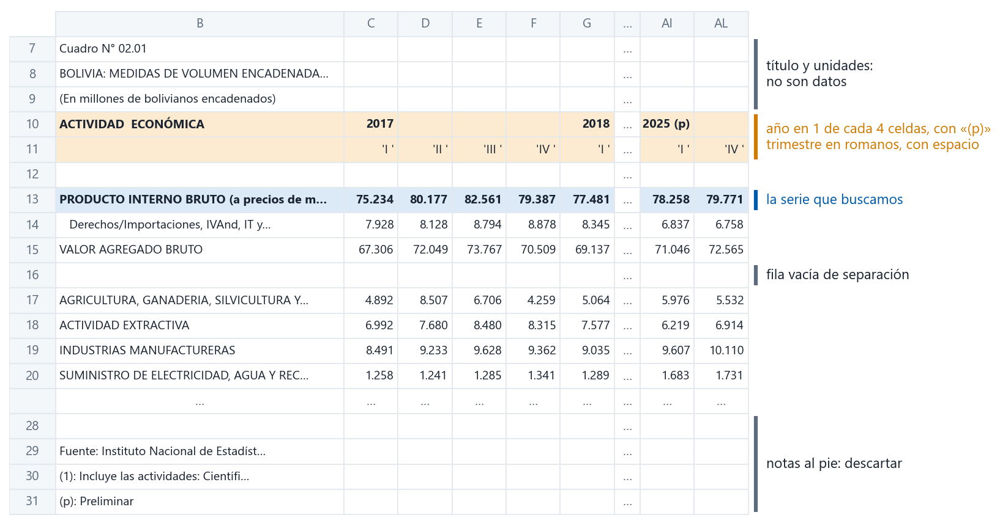
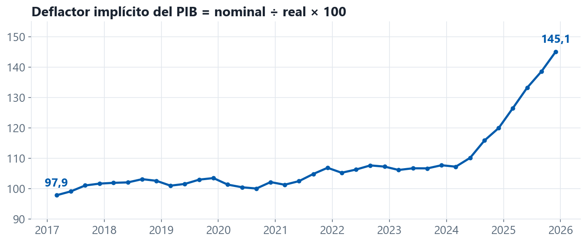

## Tres maneras de traer un dato

| | cómo | ejemplo en este taller |
|---|---|---|
| **API** | se piden datos a un servicio que responde en formato estructurado | FRED (metales, tasas de EE.UU.) |
| **Archivo directo** | se descarga un `.xlsx` / `.csv` desde una URL fija | EIA (Brent), US Census (comercio) |
| **Página web** | se lee el HTML, se encuentra el enlace o la tabla y se descarga | INE, BCB |

::: {.nota}
Preferir en ese orden: una API es estable y documentada; una página web cambia sin aviso.
:::

::: notes
~1 min. Casi todo lo boliviano está en la tercera fila, y por eso la charla sigue un ejemplo completo de esa fila.
:::

# Un ejemplo completo {.divisor background-color="#003D73"}

[El PIB trimestral del INE, de la página al CSV]{.etiqueta}

## La receta

:::: {.columns}
::: {.column width="50%"}
1. **Mirar** la página
2. **Pedir** la página
3. **Encontrar** el enlace
:::
::: {.column width="50%"}
4. **Descargar** el archivo
5. **Ordenar** la hoja
6. **Guardar** y **comprobar**
:::
::::

<br>

`www.ine.gob.bo/referencia2017/pib_trimestral.html`

::: notes
Las seis etapas son las mismas para el INE, el BCB o la EIA; cambia el detalle de cada una. Seguimos el PIB real porque es la variable objetivo del nowcast. Todo lo que se muestra se verificó contra la página el 30 de septiembre de 2026.
:::

## 1 · Mirar la página

:::: {.columns}
::: {.column width="38%"}
- La página lista **24 cuadros**, cada uno con un enlace de descarga
- Clic derecho sobre el enlace → **Inspeccionar**
- El enlace no termina en `.xlsx`: se reconoce **por su texto**
:::
::: {.column width="62%"}
```{.html}
<a class="flex items-center text-red-700 ..." download=""
   href="https://nube.ine.gob.bo/index.php/s/1RFsK6XS7ZuMXaH/download">
  <svg> … </svg>
  <span>BOLIVIA: MEDIDAS DE VOLUMEN ENCADENADAS DEL
        PRODUCTO INTERNO BRUTO POR GRUPOS DE ACTIVIDAD
        ECONÓMICA SEGÚN TRIMESTRE, 2017 - 2025</span>
</a>
```
:::
::::

::: notes
Tres piezas de HTML bastan: la etiqueta `<a>` es un enlace; el atributo `href` es adónde lleva; el texto entre etiquetas es lo que lee una persona. El código `1RFsK6XS7ZuMXaH` lo genera el servidor de archivos del INE y cambia cuando el INE vuelve a subir el cuadro, así que copiar la URL a mano sirve hasta la próxima actualización.
:::

## 2 · Pedir la página

```{.python}
import requests

URL = "https://www.ine.gob.bo/referencia2017/pib_trimestral.html"
r = requests.get(URL, headers={"User-Agent": "Mozilla/5.0"}, timeout=60)

r.status_code, r.headers["content-type"], len(r.content)
# (200, 'text/html', 42746)
```

| código | significa |
|---|---|
| `200` | todo bien |
| `403` | el servidor rechaza al cliente: probar otro *user-agent* |
| `404` | la dirección ya no existe |
| `500`, `503` | falla del servidor: esperar y reintentar **una** vez |

::: notes
Lo que vuelve es texto: el mismo HTML que se vio con Inspeccionar. El *user-agent* le dice al servidor quién pide; varias oficinas responden 403 al de Python por defecto. `timeout` evita que el cuaderno se quede colgado.
:::

## 3 · Encontrar el enlace

```{.python}
from bs4 import BeautifulSoup

sopa = BeautifulSoup(r.content, "lxml")
enlaces = [(a.get_text(" ", strip=True), a["href"])
           for a in sopa.find_all("a", href=True) if "/download" in a["href"]]
len(enlaces)   # 24
```

```{.text}
[ 1] BOLIVIA: PRODUCTO INTERNO BRUTO  POR GRUPOS DE ACTIVIDAD ECONÓMICA ...
[ 7] BOLIVIA: MEDIDAS DE VOLUMEN ENCADENADAS DEL PRODUCTO INTERNO BRUTO ...
[ 8] BOLIVIA: INDICES DE VOLUMEN ENCADENADOS DEL PRODUCTO INTERNO BRUTO ...
[ 9] BOLIVIA: VARIACIÓN DE LAS MEDIDAS DE VOLUMEN ENCADENADAS DEL PRODUCTO ...
[11] BOLIVIA: CONTRIBUCIÓN A LA VARIACIÓN DE LAS MEDIDAS DE VOLUMEN ...
```

::: {.alerta}
Siete títulos contienen «volumen encadenado» y «producto». Buscar por palabras clave no basta.
:::

::: notes
Imprimir la lista completa antes de elegir: así la elección es visible y no depende de la posición del enlace en la página, que cambia.
:::

## 3 · … por su título completo

```{.python}
import unicodedata

def clave(s):
    """Sin tildes, en minúsculas y con un solo espacio entre palabras."""
    s = unicodedata.normalize("NFKD", s).encode("ascii", "ignore").decode()
    return " ".join(s.lower().split())

buscado = clave("BOLIVIA: MEDIDAS DE VOLUMEN ENCADENADAS DEL PRODUCTO INTERNO BRUTO POR GRUPOS")
hits = [href for texto, href in enlaces if clave(texto).startswith(buscado)]
assert len(hits) == 1, "el INE cambió el título: revisar la lista"
```

::: {.alerta}
El título del PIB nominal tiene **dos espacios** seguidos: `"BRUTO  POR"`. Una comparación literal no lo encuentra; `clave()` sí.
:::

::: notes
Se compara el **comienzo** del título, no un puñado de palabras: así se descartan «VARIACIÓN DE LAS MEDIDAS…» y «CONTRIBUCIÓN A…». Si aparecen cero o dos coincidencias, el código se detiene en lugar de bajar el cuadro equivocado.
:::

## 4 · Descargar y abrir sin interpretar

```{.python}
from io import BytesIO
import pandas as pd

archivo = requests.get(hits[0], headers={"User-Agent": "Mozilla/5.0"}, timeout=120)
archivo.headers["content-disposition"]      # ... filename="T_02.01.xlsx"

raw = pd.read_excel(BytesIO(archivo.content), header=None)
raw.shape                                   # (32, 38)
```

- `header=None`: pandas no adivina encabezados; se ve la hoja **tal como es**
- El nombre real del archivo viene en la respuesta, no en la URL

::: notes
`BytesIO` deja leer el archivo desde la memoria sin escribirlo antes en disco. La hoja tiene 38 columnas: la A vacía, la B con las etiquetas y 36 trimestres (2017–2025).
:::

## 5 · La hoja tal como llega

{fig-align="center" width="92%"}

::: notes
Cada recuadro es una decisión del código. Las primeras seis filas están vacías. El año aparece sólo en el primero de sus cuatro trimestres porque en Excel la celda está combinada. «2025 (p)» marca datos preliminares. Los trimestres llevan un espacio al final ('I '), que rompe una comparación con 'I'.
:::

## 5 · De la hoja a una serie

```{.python}
ROMANO = {"I": 3, "II": 6, "III": 9, "IV": 12}         # último mes del trimestre

etiq   = raw[1].astype(str).str.strip()
fila   = etiq[etiq.str.startswith("ACTIVIDAD")].index[0]           # fila 10 de Excel
anio   = raw.iloc[fila, 2:].ffill().astype(str).str[:4]            # '2025 (p)' -> '2025'
mes    = raw.iloc[fila + 1, 2:].astype(str).str.strip().map(ROMANO) # 'I ' -> 3
fechas = pd.to_datetime(anio + "-" + mes.astype(str) + "-01")

valores = raw.loc[etiq.str.startswith("PRODUCTO INTERNO"), 2:].iloc[0]
pib = pd.Series(valores.astype(float).values, index=fechas, name="gdp")
```

```{.text}
2017-03-01    75234.2
2017-06-01    80176.5
...
2025-12-01    79771.4          36 trimestres
```

::: notes
Las filas se buscan **por su etiqueta**, nunca por número: si el INE agrega una fila arriba, el código sigue funcionando. Convención del taller: un trimestre se fecha el primer día de su último mes (2017T1 = 2017-03-01). El resultado es idéntico, valor por valor, a `raw/ine_gdp.csv`.
:::

## 6 · Guardar y comprobar

:::: {.columns}
::: {.column width="40%"}
```{.python}
pib.to_csv("raw/ine_gdp.csv")
```

- El crudo se guarda **sin editar**
- Se repite con el cuadro nominal y se divide uno por otro
- El deflactor debe **subir**
:::
::: {.column width="60%"}
{width="100%"}
:::
::::

::: {.alerta}
Si el deflactor baja, se bajaron los cuadros al revés.
:::

::: notes
Los cuadros real y nominal tienen títulos casi iguales y se leen con el mismo código, así que es fácil tomar uno por otro. El nowcast es sobre crecimiento real: la serie nominal mezcla la inflación, que en Bolivia sube con fuerza desde 2024 (el deflactor pasa de ~107 a 145).
:::

# Otras fuentes, la misma receta {.divisor background-color="#003D73"}

## Lo que cambia de una fuente a otra

| fuente | 3 · encontrar | 5 · ordenar |
|---|---|---|
| **INE**, otros 30 cuadros | URL guardada en una tabla de fuentes | tres diseños de hoja distintos |
| **BCB**, boletín semanal | el nombre cambia cada semana: `Semanal 38_2026.xlsx` | series por **nombre**; fechas repartidas en dos filas |
| **EIA**, Brent | el único enlace `.xls` de la página | la hoja cuyo nombre dice «data»; dos filas de título |
| **Baker Hughes**, taladros | URL fija, que algún día cambia | filtrar `country == "BOLIVIA"` |

::: notes
BCB: la lista de boletines usa espacios irregulares y codificación en los enlaces (`Semanal%2038_2026`, `Semanal 33_ 2026`); se decodifican con `unquote` y se toma la semana más alta. La fila 57 de 2022 hoy es una celda vacía: buscar por etiqueta sobrevive a esos cambios. Baker Hughes responde 403 a un *user-agent* de navegador y acepta el de Python, al revés que el INE.
:::

## Cuando los datos están en la página

Si la página muestra una tabla HTML (`<table>`), una línea basta:

```{.python}
tablas = pd.read_html(r.text, decimal=",", thousands=".")   # lista de DataFrames
tablas[0].head()
```

::: {.nota}
La página del PIB no tiene ninguna `<table>`: los datos están en los Excel. Primero **mirar**, después elegir la herramienta.
:::

::: notes
`decimal` y `thousands` importan en páginas en español: «1.234,5» se lee mal con la configuración inglesa por defecto. `read_html` devuelve una lista porque una página puede tener varias tablas.
:::

## Una API en cinco líneas

```{.python}
url = "https://api.stlouisfed.org/fred/series/observations"
params = {"series_id": "PZINCUSDM", "api_key": CLAVE, "file_type": "json"}
obs = requests.get(url, params=params, timeout=30).json()["observations"]

zinc = pd.DataFrame(obs)[["date", "value"]]
```

- Sin HTML ni Excel: la respuesta ya es una tabla
- La **clave** es gratuita y personal: no se comparte ni se sube a GitHub

::: notes
~1 min. FRED no tiene plata ni oro (PSILVERUSDM da error 400); el sustituto es el índice de precios de la minería de oro y plata.
:::

## Cuando el servidor no coopera

:::: {.columns}
::: {.column width="50%"}
### Síntomas
- `403 Forbidden`
- la descarga se queda colgada
- funciona un día y al otro no
:::
::: {.column width="50%"}
### Qué hacer
- probar otro *user-agent* o librería
- `timeout` y **un** reintento
- si falla, **avisar y seguir** con lo que ya se tiene
:::
::::

::: {.alerta}
**Nunca sobrescribir datos buenos con una descarga parcial.** Combinar lo nuevo con el archivo existente antes de guardar.
:::

::: notes
Baker Hughes se cuelga con `requests` y responde en menos de un segundo con `urllib`: los encabezados extra que envía `requests` bastan para trabarlo. Una corrida que sólo alcanzó el mes actual reemplazó una vez trece años de historia con 25 filas; por eso el cuaderno combina antes de escribir.
:::

## Buenas prácticas

1. Un CSV **crudo, sin editar**, por fuente, en `raw/`
2. Limpiar y unir **después**, en un paso aparte
3. Una pausa entre consultas: el servidor es de todos
4. Anotar de dónde salió cada serie: URL y fecha de descarga
5. Comprobar con algo que se conoce: el deflactor, la caída de 2020

::: notes
El punto 4 es el que alimenta los metadatos de la base, que se construyen en la segunda parte de la actividad.
:::
